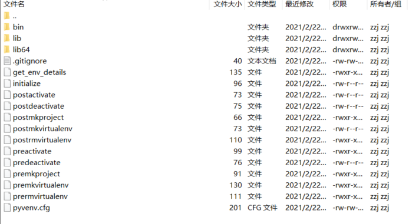

# centos下setnry环境配置
## 安装python27!!只能是27
### python版本查看和确认
登陆源里https://pypi.tuna.tsinghua.edu.cn/simple/sentry/, 命名后面有Pyxx就是python的版本
### 安装
`sudo yum install -y python`, 如果不能sudo的话得在/etc/sudoers文件里配置当前用户为sudoers
> sudoers: zzj ALL=(ALL) NOPASSWD: ALL

### 配置国内镜像源
-> 创建配置文件`mkdir -p ~/.pip/pip.conf`

-> `vim ~/.pip/pip.conf`添加如下配置，配置为清华大学镜像源

```
[global]
index-url = https://pypi.tuna.tsinghua.edu.cn/simple
[install]
trusted-host=mirrors.aliyun.com
```

## 安装redis
yum install -y redis


## 安装python虚拟环境
**官方推荐使用venv去创建虚拟环境，这里用的vitualenv**

作用：在多python项目的服务器中， 保持依赖独立性， 不至于影响别的项目

-> `py -m pip install --upgrade pip`保证pip是最新的

-> `python3 -m pip install --user virtualenv`// 用于创建每个python的独立工作区，使python项目之间不会互相影响

-> `pip install --user virtualenvwrapper`// 方便切换python虚拟环境

官方来源： https://packaging.python.org/guides/installing-using-pip-and-virtual-environments/#

## vitualenvwrapper安装和使用
-> `whereis virtualenvwrapper.sh`, 我这边是/home/zzj/.local/bin/virtualenvwrapper.sh

-> virtualenvwrapper配置需要环境python, virtualenv, virtualwrapper自身的存储目录所以得先配置好(可以直接在终端里输入也可以写入到~/.bashrc文件里)
```
$ export WORKON_HOME=$HOME/python-workspace   // python虚拟环境存储目录
$ export PROJECT_HOME=$HOME/www
$ export VIRTUALENVWRAPPER_PYTHON=/usr/bin/python3   // python
$ export VIRTUALENVWRAPPER_VIRTUALENV=/usr/local/bin/virtualenv // 可直接用whereis virtualenv查看一下virtualenv的路径
```

-> `$ source /usr/local/bin/virtualenvwrapper.sh`执行virutalenvwrapper文件

#### 创建好虚拟环境后, 项目里的结构如下



## sentry安装
-> ``

->


## 来源
#### 主体流程参考
https://blog.csdn.net/CPPCPPCPPCPP/article/details/86373795

#### python3下的vitualenvwrapper安装教程
https://medium.com/@gitudaniel/installing-virtualenvwrapper-for-python3-ad3dfea7c717
https://virtualenvwrapper.readthedocs.io/en/latest/install.html#shell-startup-file

#### sentry安装
https://policy-sentry.readthedocs.io/en/0.6.9/user-guide/installation.html#shell-completion

#### 最后编辑时间
2021年2月23日 15:52:45
