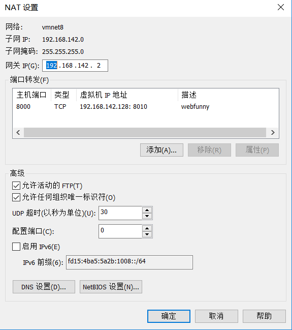

## 本地虚拟机部署webfunny_monitor从0到局域网能访问
### 虚拟机固定为静态的IP

### 项目依赖安装
1. 安装Node, git
直接在终端里敲入node和git， 当检测不到node或git的时候会提示是否安装对应的依赖，然后一路y就可以了

2. 安装MySQl

### 配置局域网可访问
1. vmware -> 编辑 -> 虚拟网络编辑器 -> VMnet8, NAT设置, 设置window和linux的端口转发

> 如上图设置完之后， 就可以通过window的IP， 如我的是10.193.53.49; 则可以用10.193.53.49:8000将连接转发给虚拟机的8011端口中；
  使得能在局域网里访问虚拟机

2. 打开linux虚拟机的防火墙(当然最后就是只放开端口的限制)
- 暂时关闭防火墙(重启就会重新打开): `sudo systemctl stop firewalld`
- 永久关闭防火墙: `sudo systemctl disable firewalld`
- 查看防火墙状态: `systemctl status firewalld`
