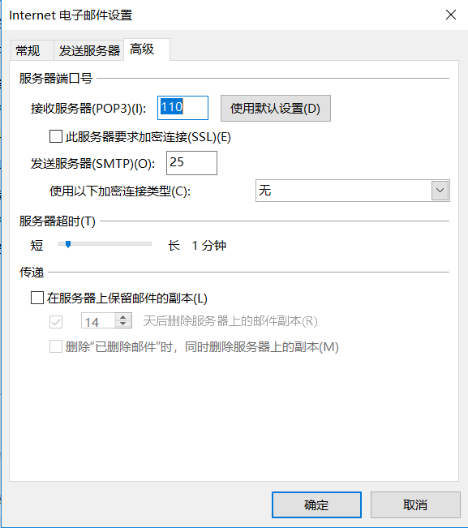

### 常见邮箱协议

##### POP3(邮件接收协议)
端口号995

##### SMTP(邮件发送协议)
- POP3: 邮件接收（从邮件服务器下载邮件）， 客户删除不会影响邮件服务器中的文件
- IMAP: 交互式邮件存取协议； 在电子邮件客户端收取的邮件仍然保留在服务器上，同时在客户端上的操作都会反馈到服务器上，如：删除邮件，标记已读等，服务器上的邮件也会做相应的动作。（客户操作能影响服务器上的源文件）
- SMTP：简单邮件传输协议（发送的时候会用到）

|  协议名   | QQ服务器地址  |  SSL协议端口 |  非SSL协议端口 |
|  ----  | ----  |  ----  | ---- |
| IMAP  | 单元格 |  993	| 143 |
| SMTP  | smtp.qq.com |  465或587 | 25 |
| POP3  | smtp.qq.com |  995 | 110 |

开启secure端口号为465, 否则为587(或者25)

来源： https://www.jianshu.com/p/d1a732327917

> outlook查看邮件服务器默认端口方法：  
  **文件 > 账户设置 > 进入账户，进入当前正在使用的用户设置 > 其他设置 > 高级**

  